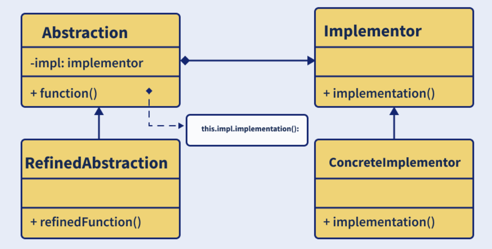

# Bridge Design Pattern

  There are 4 main elements of Bridge Pattern.
*     Abstraction – This is the core of the pattern and it defines its crux. This contains a reference to the implementer.
*     Refined Abstraction – This extends the abstraction and takes refined details of the requirements and hides it from the implementors.
*     Implementer – This is the interface for the implementation classes.
*     Concrete Implementation – These are the concrete implementation classes that implement the Implementer interface.

  **The implementation of bridge design pattern follows the notion to prefer Composition over inheritance.**

In the Bridge design pattern, the interface that declares the implementation methods is called the Implementor. It is the interface that the Abstraction uses to interact with the implementation classes. By using an interface, the Abstraction is decoupled from the implementation details, allowing them to vary independently. The Implementor interface can have any number of methods, which are implemented by the concrete Implementor classes. This abstraction helps in avoiding the binding of implementation classes to the Abstraction class.

In the Bridge design pattern, the abstraction is a higher-level class that contains a reference to the implementation. This class defines the interface that the client uses to access the implementation. The abstraction class provides a common interface to the clients that hides the implementation details.

The abstraction class is usually an abstract class, as it defines the common interface and some of the implementation details. However, it does not provide a complete implementation of the methods, and it delegates the implementation to the implementation classes.

The abstraction class is called "abstraction" because it provides an abstraction layer between the client and the implementation. It allows the clients to work with the abstraction without being aware of the implementation details. The abstraction also allows the implementation to vary independently from the clients, which improves the flexibility and maintainability of the system.

References:
https://www.digitalocean.com/community/tutorials/bridge-design-pattern-java
https://www.interviewbit.com/design-patterns-interview-questions/
https://www.youtube.com/watch?v=88kAIisOiYs
